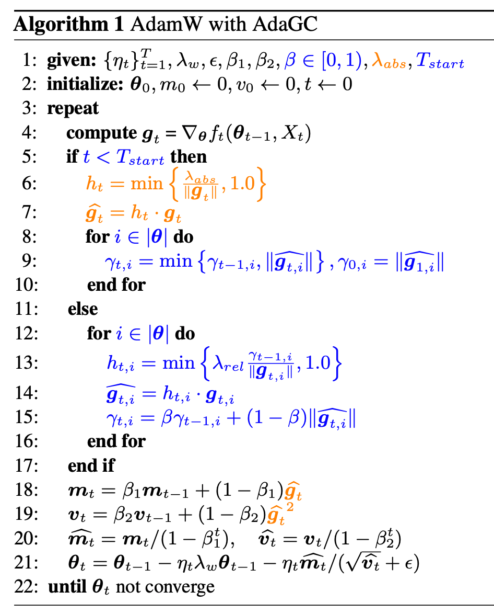

<div align="center">

# AdaGC

### Enhancing LLM Pretraining Stability via Adaptive Gradient Clipping

[](https://arxiv.org/abs/2502.11034)
[](../../LICENSE)
[](https://www.python.org/)
[](https://www.paddlepaddle.org.cn/)

</div>

---

## Overview

Loss spikes are a common obstacle in large-scale LLM pretraining. Although they may be triggered by diverse factors such as data outliers, numerical precision issues, hardware faults, or optimizer hyperparameters, they often share a common consequence: abnormal gradients contaminate optimizer states and lead to unstable updates.

**AdaGC** is an optimizer-agnostic tensor-wise adaptive gradient clipping method. It tracks the historical gradient norm of each parameter tensor with an exponential moving average (EMA), and clips only those gradients that significantly deviate from their own historical scale. By suppressing abnormal gradients before they enter optimizer states, AdaGC improves pretraining stability while preserving normal learning dynamics.

AdaGC introduces negligible memory overhead, reduces communication compared with GlobalGC in hybrid-parallel training, and has been validated on dense and MoE LLMs including Llama-2, Qwen3, Mixtral, and ERNIE.

*Code is available at https://github.com/PaddlePaddle/Paddle/pull/79041. Detailed instructions and examples will be released soon. Please stay tuned!*

## 🔔 News

- **[2026.06.03]** 🎉 We have released the PyTorch implementation of AdaGC! Code is available at [AdaGC](https://github.com/lishuai-97/AdaGC).
- **[2026.05.01]** 🎉 Our paper has been accepted by **ICML 2026**!


## 📌 TODO

- [ ] Release PaddlePaddle evaluation code.
- [x] Release PyTorch evaluation code.

## Method

<p align="center">
  
</p>

AdaGC stabilizes LLM pretraining through tensor-wise adaptive gradient clipping. Instead of applying a single global threshold to all gradients, AdaGC maintains an EMA of each tensor's historical gradient norm and uses it as a local adaptive reference for clipping.

For the $i$-th tensor, AdaGC performs:

```math
g_{t,i} \leftarrow h_{t,i} g_{t,i}, \qquad
h_{t,i} = \min\left\{1.0, \frac{\lambda_{\mathrm{rel}}\gamma_{t-1,i}}{\lVert g_{t,i}\rVert}\right\}
```

where the EMA state is updated as:

```math
\gamma_{t,i} = \beta \gamma_{t-1,i} + (1-\beta)\lVert g_{t,i}\rVert
```

| Stage | Name | Description |
|---|---|---|
| 1 | Warm-up with GlobalGC | During the initial unstable training stage, AdaGC applies GlobalGC and initializes tensor-wise EMA states. |
| 2 | Tensor-wise Norm Tracking | For each parameter tensor, AdaGC tracks an EMA of historical clipped gradient norms as its adaptive reference scale. |
| 3 | Adaptive Gradient Clipping | Each tensor is clipped independently when its current gradient norm exceeds its own EMA-based threshold, preventing abnormal gradients from entering optimizer states. |

Compared with GlobalGC, AdaGC provides temporal adaptivity, tensor-wise locality, and lower communication overhead in hybrid-parallel distributed training.

---

## Citation

If you find this work useful, please cite our paper:

```bibtex
@article{wang2025adagc,
  title={AdaGC: Enhancing LLM Pretraining Stability via Adaptive Gradient Clipping},
  author={Wang, Guoxia and Li, Shuai and Chen, Congliang and Zeng, Jinle and Yang, Jiabin and Yu, Dianhai and Ma, Yanjun and Shen, Li},
  journal={arXiv preprint arXiv:2502.11034},
  year={2025}
}
```

## License

This project is licensed under the Apache License 2.0 — see the [LICENSE](../../LICENSE) file for details.
